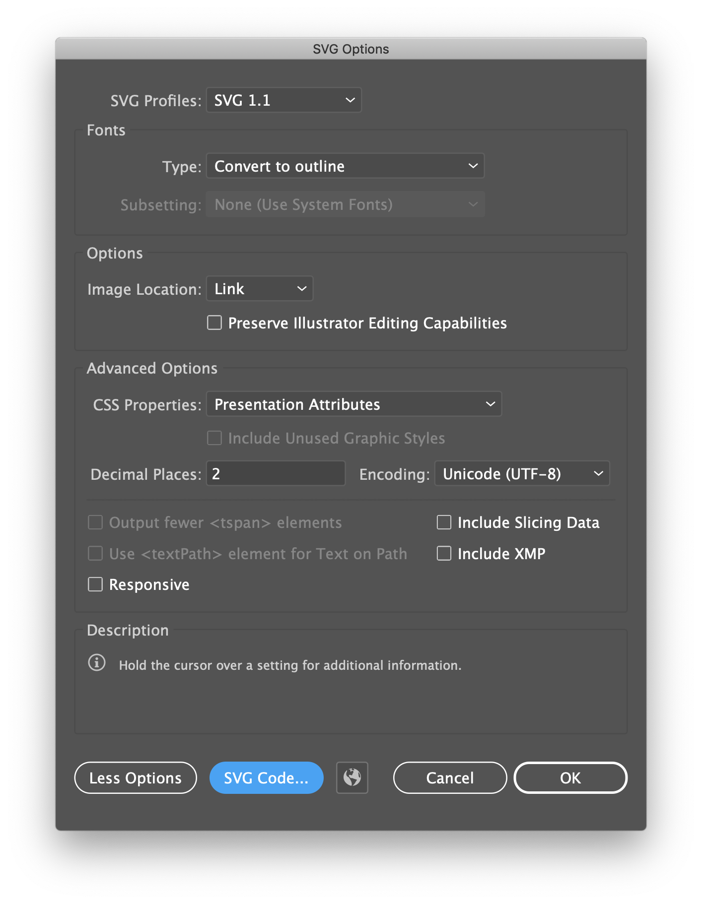

# Noto Emoji SVG

OpenType-SVG version of [Noto Emoji](https://github.com/googlefonts/noto-emoji).

### :warning: NOTE :warning:

The repository contains aliases/symlinks. Cloning on Windows
requires using the option `-c core.symlinks=true` and running the command with
Admin privileges.

	git -c core.symlinks=true clone https://github.com/adobe-fonts/noto-emoji-svg.git

You may also need to pull using this command,

	git -c core.symlinks=true pull

and configure the repository with this command,

	git config core.symlinks true

### Requirements

* Python 3.6+
* FontTools

## Building the fonts

To build the **black-and-white font** use the following command,

	python3 make_bw_font.py -o fonts -r x.xxx --gsub GSUB.fea --gpos GPOS.fea --uvs UVS.txt svg_bw

where `x.xxx` is the version number to be assigned to the font (e.g `1.082`).

## Subroutinizing the OTFs

The OT-CFF fonts can be subroutinized with the following command:

	sh subroutinize.sh 

Subroutinizing requires AFDKO's `tx` and `sfntedit` tools.

## Generating the HTML test document

To help thoroughly test the fonts, a script was developed that generates
[an HTML file](test.html) that lists all official emoji and emoji sequences.
The current output shows Unicode version 11. To generate the file run this command:

	python3 test/generate_test_html.py

To divide the output into multiple files use the `--paginate` option:

	python3 test/generate_test_html.py -p

## Generating aliases

Aliases/symbolic links are used extensively to avoid having multiple copies of the
same artwork.

To generate **black-and-white aliases** run this command:

	python3 make_aliases.py emoji_bw_aliases.txt svg_bw

To generate **SVG color aliases** run this command:

	python3 make_aliases.py emoji_color_aliases.txt svg

To generate **PNG color aliases** run this command:

	python3 make_aliases.py emoji_color_aliases.txt png

## Cleaning/sanitizing the SVG artwork

Whenever the SVG files are edited and saved with Adobe Illustrator they contain
unnecessary data that can and should be removed.

To clean the **black-and-white artwork** run this command:

	python3 svg_cleaner.py -k bw svg_bw

To clean the **color artwork** run this command:

	python3 svg_cleaner.py svg

## Adobe Illustrator saving options

